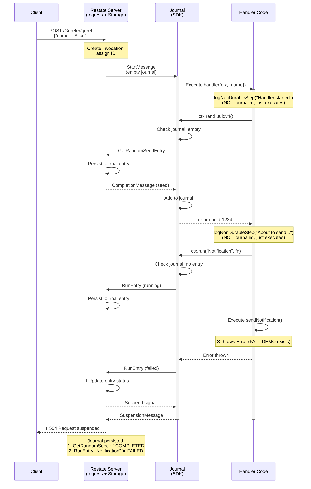
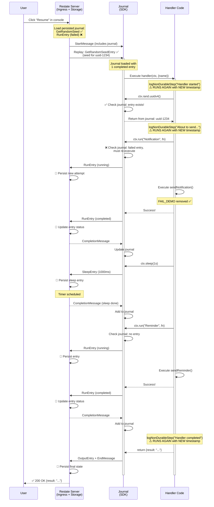

# Restate Journal Protocol - Sequence Diagrams

## Initial Invocation (First Execution)

## Resume After Fix (Replay Execution)

## Key Observations

### What Gets Journaled (Durable)
- ✅ `ctx.rand.uuidv4()` → `GetRandomSeedEntry`
- ✅ `ctx.run()` → `RunEntry` with result
- ✅ `ctx.sleep()` → `SleepEntry`
- ✅ Return value → `OutputEntry`

**Result**: On replay, SDK returns stored values without re-executing

### What Does NOT Get Journaled (Replayed)
- ⚠️ `logNonDurableStep()` - regular code outside ctx operations
- ⚠️ `console.log()` - side effects not in ctx.run()
- ⚠️ File writes via `appendFileSync()` - not wrapped in ctx.run()

**Result**: On replay, these execute again with new timestamps!

## Protocol Messages

| Message | Direction | Purpose |
|---------|-----------|---------|
| `StartMessage` | Runtime → SDK | Begin invocation, includes journal size |
| `GetRandomSeedEntry` | SDK → Runtime | Request deterministic random seed |
| `RunEntry` | SDK → Runtime | Execute side effect (or replay result) |
| `SleepEntry` | SDK → Runtime | Durable timer |
| `CompletionMessage` | Runtime → SDK | Entry completed with result |
| `SuspensionMessage` | SDK → Runtime | Pause, waiting for retry |
| `EndMessage` | SDK → Runtime | Invocation successful |
| `OutputEntry` | SDK → Runtime | Final return value |

## Durability Guarantees

**Critical**: Each journal entry is persisted to the Restate Server **before** execution continues:

1. SDK creates journal entry → sends to Runtime
2. Runtime persists to storage → acknowledges to SDK
3. Only then does SDK proceed with next operation

This means:
- **Process crashes** → Journal is safe, resume from last persisted entry
- **Network failures** → Runtime has durable record, can retry
- **Service restarts** → Full execution history available for replay

## Why This Matters

The demo shows that:
1. **Journal entries are replayed** - same UUID, same results
2. **Regular code is re-executed** - different timestamps in `replay-log.txt`
3. **Partial progress preserved** - notification doesn't run again on resume
4. **Deterministic execution** - same inputs, same outputs, every time
5. **True durability** - every step persisted before proceeding
