# Durable Execution
## Building Apps That Refuse to Die

Sam Dengler

DevNexus 2026

---
layout: two-cols-header
---

# About Me


::left::

**Sam Dengler**
<br>Sr Principal Engineer, JPMorganChase

AWS, serverless, event-driven architectures, distributed systems, AI engineering

::right::

@samdengler
<br>[Twitter](https://twitter.com/samdengler) / [LinkedIn](https://linkedin.com/in/samdengler) / [GitHub](https://github.com/samdengler)

---

# Agenda

Durable Execution

1. Introduction
2. Developer Experience
3. Resiliency and Failover

---

# The Problem

Building distributed applications is hard

- Retries — how many? With backoff? Idempotency?
- State management — where does it live? What if it's stale?
- Failure recovery — what step were we on? Can we resume?
- Orchestration — sagas, compensations, dead letter queues...

**We spend more time on plumbing than business logic.**

---

# What is Durable Execution?

Persist execution progress. Resume seamlessly after crashes.

- Your code runs **exactly as written** — normal functions, normal control flow
- The runtime journals each step as it completes
- On failure, replay from the journal — skip completed steps
- You focus on **business logic**, not infrastructure

---

# The Landscape

Durable execution is a growing space

<div class="relative mt-12">
  <!-- Normal state -->
  <div class="grid grid-cols-3 gap-8 text-center">
    <div class="p-4 flex flex-col items-center gap-2">
      <div class="h-20 w-20 rounded-full border-2 border-gray-500 flex items-center justify-center" style="background-color: #141414;">
        
      </div>
      <span>Temporal</span>
    </div>
    <div class="p-4 flex flex-col items-center gap-2">
      <div class="h-20 w-20 rounded-full border-2 border-gray-500 flex items-center justify-center" style="background-color: #CF6A18;">
        
      </div>
      <span>Lambda Durable Functions</span>
    </div>
    <div class="p-4 flex flex-col items-center gap-2">
      <div class="h-20 w-20 rounded-full border-2 border-gray-500 flex items-center justify-center" style="background-color: #171717;">
        
      </div>
      <span>Inngest</span>
    </div>
    <div class="p-4 flex flex-col items-center gap-2">
      <div class="h-20 w-20 rounded-full border-2 border-gray-500 flex items-center justify-center" style="background-color: #1E2533;">
        
      </div>
      <span>DBOS</span>
    </div>
    <div class="p-4 flex flex-col items-center gap-2">
      <div class="h-20 w-20 rounded-full border-2 border-gray-500 flex items-center justify-center overflow-hidden" style="background-color: #ffffff;">
        
      </div>
      <span>Restate</span>
    </div>
    <div class="p-4 flex flex-col items-center gap-2">
      <span class="h-20 w-20 rounded-full border-2 border-gray-500 flex items-center justify-center text-2xl">+</span>
      <span>and others...</span>
    </div>
  </div>
</div>

---

# Meet Restate

A lightweight runtime for durable execution

- **Durable async/await** — write normal code, get automatic resilience
- **Journaling** — every side effect is recorded and replayed on retry
- **Virtual objects** — stateful entities with built-in K/V state
- **Workflows** — long-running operations with signals and timers

---

# Demo: Greeter Service

```ts
async (ctx: restate.Context, { name }) => {
  // Each step is durably executed
  const greetingId = ctx.rand.uuidv4();
  await ctx.run("Notification", () =>
    sendNotification(greetingId, name));
  await ctx.sleep({ seconds: 1 });
  await ctx.run("Reminder", () =>
    sendReminder(greetingId, name));
  return { result: `You said hi to ${name}!` };
}
```

What happens when `sendReminder` fails?

---

# Demo: Live

Register the service with Restate:

```bash
restate deployments register http://localhost:9080
```

Invoke the greeter (happy path):

```bash
http POST localhost:8080/Greeter/greet name=DevNexus
```

Invoke with failure simulation:

```bash
http POST localhost:8080/Greeter/greet name=Alice
```

<!--
**Setup:** run `./scripts/demo.sh` before talk

**Restate UI walkthrough:**

1. Open http://localhost:9070/
2. After registering, show the **Services** tab — Greeter service appears
3. After invoking DevNexus, show **Invocations** — completed successfully
4. After invoking Alice, show **Invocations** — watch retries in real-time
5. Click into the Alice invocation to show journal entries and retry attempts
-->

---
clicks: 7
---

# Durable Execution in Action

<MinimalSequence
  :actors="[
    { id: 'client', label: 'Client' },
    { id: 'server', label: 'Restate Server' },
    { id: 'sdk', label: 'SDK' },
    { id: 'handler', label: 'Handler' },
  ]"
  :steps="[
    { from: 'client', to: 'server', label: 'POST /Greeter/greet', type: 'request' },
    { from: 'server', to: 'sdk', label: 'invoke()', type: 'request' },
    { from: 'sdk', to: 'handler', label: 'ctx.rand.uuidv4()', type: 'request' },
    { from: 'handler', to: 'handler', label: 'sendNotification()', type: 'self' },
    { from: 'handler', to: 'handler', label: 'ctx.sleep(1s)', type: 'self' },
    { from: 'handler', to: 'handler', label: 'sendReminder()', type: 'self' },
    { from: 'handler', to: 'client', label: '200 OK', type: 'response' },
  ]"
/>

<div class="mt-8 text-sm text-gray-400">
  Press → or Space to step through the execution
</div>

---

# The Execution Flow

**1. Request** → `POST /Greeter/greet` starts invocation

**2. UUID** → `ctx.rand.uuidv4()` persisted 💾 → `uuid-1234` (deterministic)

**3. Notification** → `ctx.run("Notification")` executed & journaled 💾

**4. Sleep** → `ctx.sleep(1s)` persisted 💾 → timer scheduled

**5. Reminder** → `ctx.run("Reminder")` executed & journaled 💾

**6. Return** → Result persisted 💾 → `200 OK` to client

**Every step durably persisted before proceeding!**

---

# Inside the Journal

Every invocation gets its own append-only journal

| # | Entry Type | Name | Result |
|---|-----------|------|--------|
| 0 | **Input** | | `{ name: "DevNexus" }` |
| 1 | **Run** | `uuidv4` | `"a1b2c3d4-..."` |
| 2 | **Run** | `Notification` | `void` |
| 3 | **Sleep** | | `1000ms` |
| 4 | **Run** | `Reminder` | *pending...* |

On retry, entries 0-3 are **replayed from the journal** — no re-execution. Only entry 4 runs again.

```bash
restate sql "SELECT * FROM sys_journal WHERE id = '<invocation_id>';"
```

---

# Demo: Inspecting the Journal

List invocations to get an ID:

```bash
restate invocations list
```

Describe a specific invocation:

```bash
restate invocations describe <invocation_id>
```

Query the journal directly:

```bash
restate sql "SELECT index, entry_type, name FROM sys_journal WHERE id = '<invocation_id>';"
```

<!--
**Restate UI walkthrough:**

1. Open http://localhost:9070/
2. Click **Invocations** — show the list of completed/in-progress invocations
3. Click into the Alice invocation (the one with retries)
4. Show the journal entries — each step with entry type, name, and result
5. Point out the retry attempts on the failed steps
-->

---
layout: center
---

# Part 3: Resiliency and Failover

What happens when things go wrong — and why you don't have to worry about it

---

# How Are Journal Entries Kept Safe?

Every `ctx.run()` is replicated before your code moves on

- Restate runs as a **cluster** of nodes (typically 3+)
- Each journal entry is written to **multiple nodes** simultaneously
- Restate waits for a **majority** to confirm the write before proceeding
- If one node dies, the other copies still have your data

<div class="mt-6 p-4 bg-blue-50 dark:bg-blue-900 rounded">

**Think of it like saving a document to multiple cloud drives at once.** Your code doesn't continue until the save is confirmed. Typical latency: **~3ms**.

</div>

---

# How Are Journal Entries Kept Safe?

Your handler talks to a **leader node**, which replicates to the cluster

```mermaid
sequenceDiagram
    participant H as Your Handler
    participant L as Leader Node
    participant R1 as Replica 1
    participant R2 as Replica 2

    H->>L: ctx.run() result
    L->>R1: Replicate journal entry
    L->>R2: Replicate journal entry
    R1-->>L: ACK
    R2-->>L: ACK
    Note over L: Majority confirmed (2 of 3)
    L-->>H: OK — your code continues
```



- One leader per partition — your handler always talks to it directly
- Leader fans out to replicas and waits for a **majority** to confirm
- Simple quorum replication — one round trip, no complex protocol

---

# What Happens When a Node Crashes?

Restate detects failures and recovers automatically

- The cluster **detects** the failed node via health checks
- A replica is **promoted** to become the new leader
- The new leader already has a copy of the journal (it was a replica!)
- Your handler is **reconnected** — completed steps are replayed, not re-executed

Your handler code **doesn't change**. Restate handles detection, promotion, and replay behind the scenes.

---

# What Happens When a Node Crashes?

The failover in action

```mermaid
sequenceDiagram
    participant App as Your Handler
    participant N1 as Node 1 (Leader)
    participant N2 as Node 2
    participant N3 as Node 3

    App->>N1: ctx.run() — step 3
    Note over N1: 💥 Node 1 crashes!
    N2->>N2: Detects failure
    N2->>N2: Becomes new leader
    N2->>App: Replays journal — skips steps 1-2
    App->>N2: Re-executes step 3
    Note over N2: Business as usual
```



- The new leader already has your data — it was replicating all along
- Completed steps are **skipped**, only the in-flight step re-executes
- Failover happens in **seconds**, not minutes

---

# The Three Guarantees

What Restate promises about resilience

<div class="grid grid-cols-3 gap-6 mt-8">

<div class="p-4 border rounded text-center">

### No Lost Work

Every committed step is stored on multiple nodes. A single node failure **cannot lose data**.

</div>

<div class="p-4 border rounded text-center">

### No Double Execution

On recovery, completed steps are **replayed from the journal**, not re-executed. Side effects don't repeat.

</div>

<div class="p-4 border rounded text-center">

### Fast Failover

A standby node can take over in **seconds**, not minutes. Your in-flight invocations resume automatically.

</div>

</div>

<div class="mt-6 text-center text-sm opacity-60">

No saga patterns. No dead letter queues. No manual recovery scripts.

</div>

---

# How Is This Different From What I'd Build Myself?

| DIY Approach | Restate |
|---|---|
| Database + message queue + orchestrator | **Single runtime** handles all three |
| You implement retries, idempotency, recovery | **Built in** — just write business logic |
| Coordinating failover across multiple systems | **One failover model** for everything |
| Tuning replication, consistency, timeouts | **Sensible defaults** that just work |

<div class="mt-6 p-4 bg-amber-50 dark:bg-amber-900 rounded">

Restate combines the **durability of a database**, the **messaging of a queue**, and the **orchestration of a workflow engine** into a single, fast runtime.

</div>

---

# Why This Matters

Durable execution makes resilient apps **accessible to you**

- Simplifies microservice orchestration
- Tames long-running operations
- Eliminates retry/state/recovery boilerplate
- You write business logic, not plumbing

---
layout: center
---

# Thank You

[@samdengler](https://twitter.com/samdengler)
